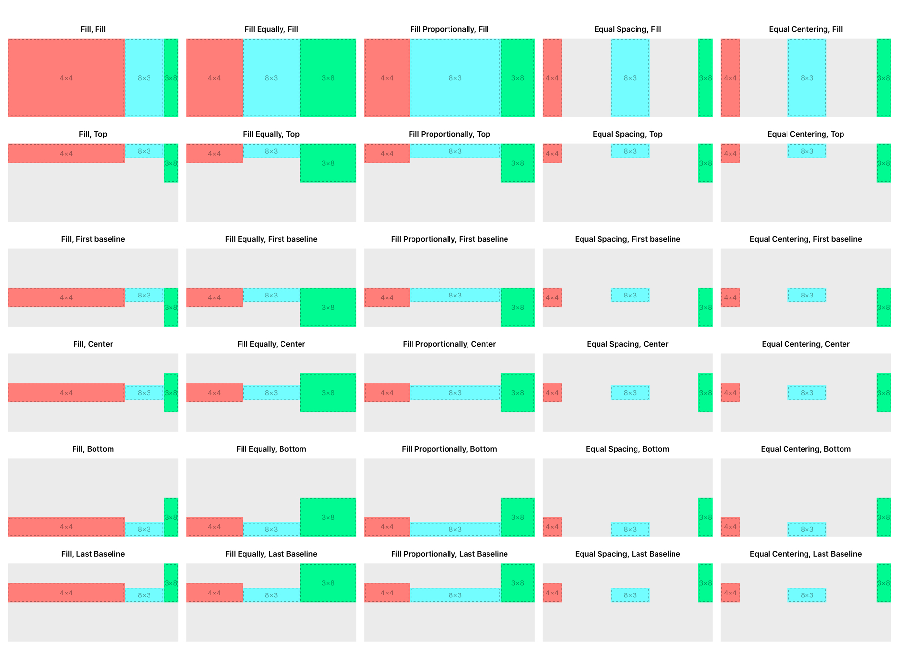

# UIStackView Demo

This is a demo app for [UIStackView: distribution vs alignment 📚](https://medium.com/@yzhong.cs/uistackview-distribution-vs-alignment-146b9612e24c).

* It shows how the stack view looks with the different combinations of `distribution` and `alignment`.
* Things are organized in a `UICollectionView` which scrolls both vertically and horizontally.
* Some tricks are used to add background color to the `UIStackView`, adding dashed borders to subviews, etc. 
* While running the application, it will capture snapshots of the stack view and save them on my Desktop 🙈 if `shouldSnapshot` is set to `true`.
* For simplicity, everything is under one file `ViewController.swift`.

